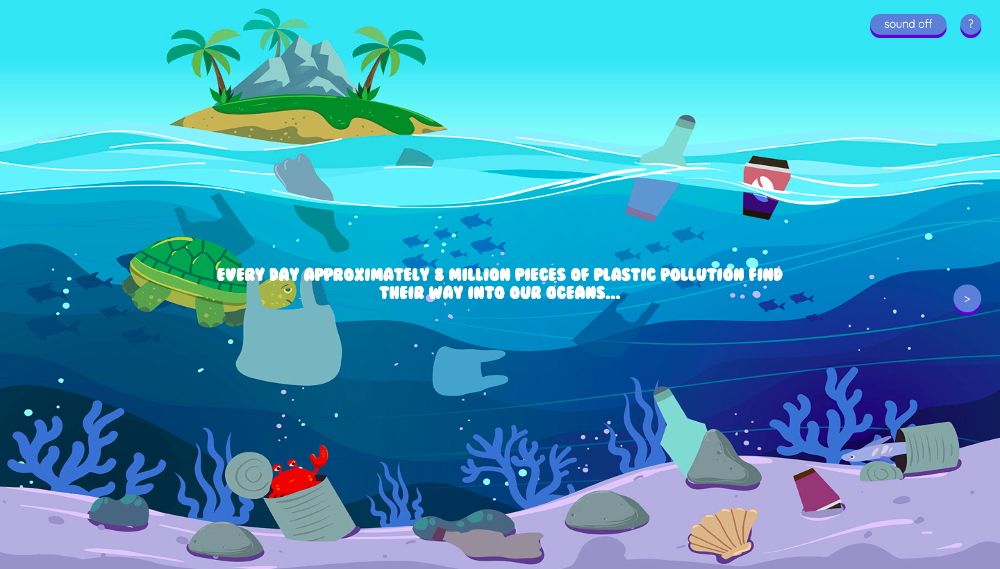

# Catch the plastics



A game built in p5.js where you as a player helps the crab to catch all the plastics and clean our oceans.

## Link
https://catch-the-plastic.netlify.app

## Authors
- [Maja Alin](https://github.com/majaalin)
- [Camilla Kylmänen Sjörén](https://github.com/camiwd)

## Installation

- Clone the repository: 
```
$ git clone https://github.com/majaalin/game-over/
```
- Run the following command in the project directory to start a local server:
```
$ php -S localhost:3000
```
- Open http://localhost:3000 to view it in the browser.
 
## Pull requests
You'll find past pull request [here](https://github.com/majaalin/game-over/blob/master/PULLREQUESTLOG.md)

## Testers
Programmers:
- Terese Thulin
- Victor Ljungblad 

Non-programmers:
- Eva Alin
- Nellie Alin
- William Alin
- Elisabeth Kylmänen
- Sven-Erik Köllerström

# Comments from testers
- 
-
-
-


## License
This project is licensed under the MIT License.
